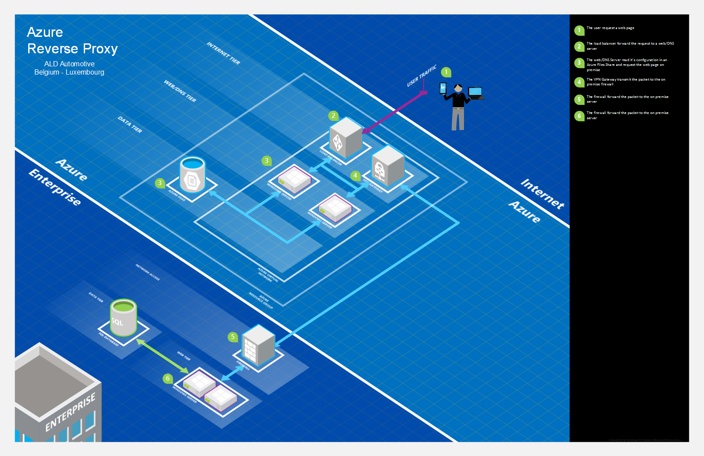

# AzureRM-LB-IIS-RAA

Deploy an Azure Resource Manager Template with in a load balancing with IIS and Routing Application Request (RAA)

## Prerequisites
To be able to automate the Azure File Share creation we need to first create an Azure Automation with a webhook based on  [CreateFileShare.ps1](RPX-Pub/Scripts/CreateFileShare.ps1)

## Components
There are three major components to achieve the result:

1. The json template deploy all the azure resources except the Azure File Share
2. The Azure Automation webhook
3. The DSC template (that trigger the webhook)

